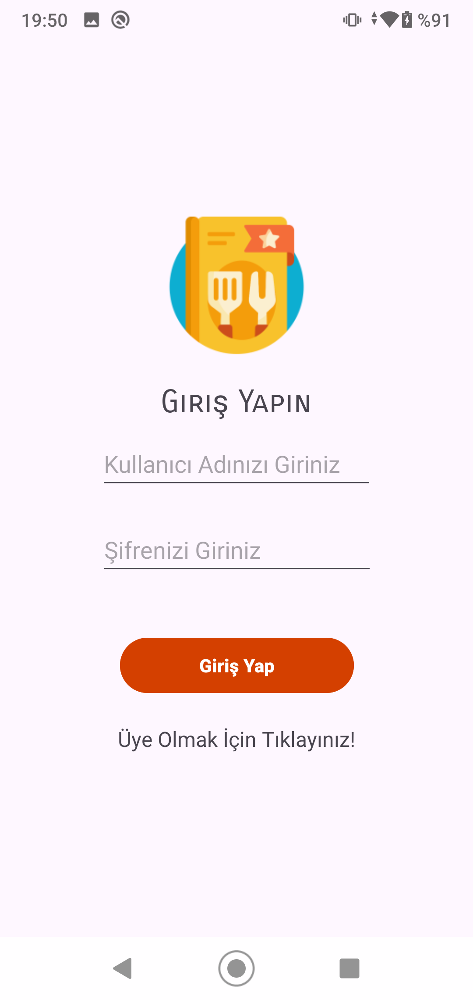
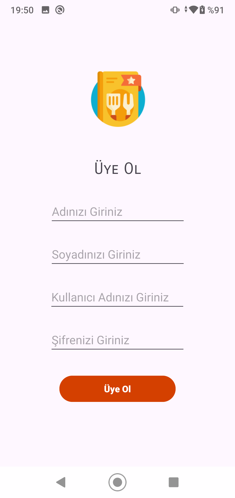
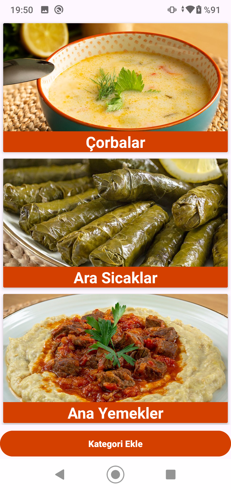
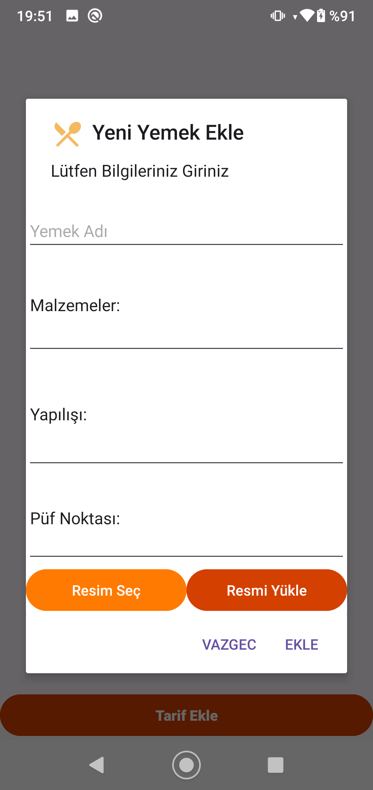
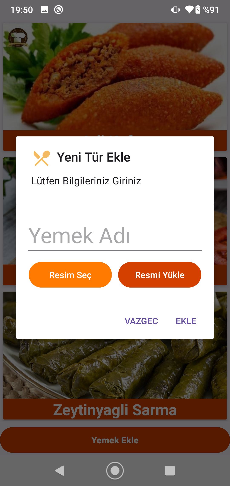

# AndroidRecipeApp

# Yemek Tarifleri Uygulaması

Bu proje, Android Studio kullanılarak Java programlama diliyle geliştirilmiş bir yemek tarifleri uygulamasını içerir. Firebase kullanılarak yapılmıştır.

## Özellikler

- Kullanıcılar yemek tariflerini görüntüleyebilir.
- Yemek tarifleri kategorilere göre filtrelenmiştir.
- Admin yemek tariflerini ekleyebilir ve düzenleyebilir.
- Oturum açma ve kayıt işlemleri Firebase ile gerçekleştirilir.
- Yemek tarifleri Firebase Realtime Database'de saklanır.

## Kullanım

1. Android Studio'da projeyi açın.
2. Firebase konsolunda yeni bir proje oluşturun ve Firebase Authentication ve Realtime Database özelliklerini etkinleştirin.
3. `google-services.json` dosyasını Firebase konsolundan indirin ve projenizin `app` klasörüne ekleyin.
4. Projeyi derleyin ve bir Android cihazında veya bir emülatörde çalıştırın.

## Ekran Görüntüleri

# Recipe Application

This project is a recipe application developed using Java programming language with Android Studio. It is built with Firebase.

## Features

- Users can view recipes.
- Recipes are filtered by categories.
- Admin can add and edit recipes.
- Login and registration are implemented with Firebase.
- Recipes are stored in Firebase Realtime Database.

## Usage

1. Open the project in Android Studio.
2. Create a new project in Firebase Console and enable Firebase Authentication and Realtime Database features.
3. Download the `google-services.json` file from the Firebase Console and add it to the `app` directory of your project.
4. Build the project and run it on an Android device or emulator.
